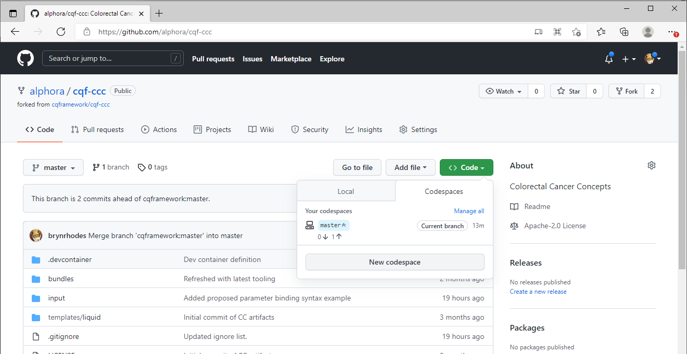
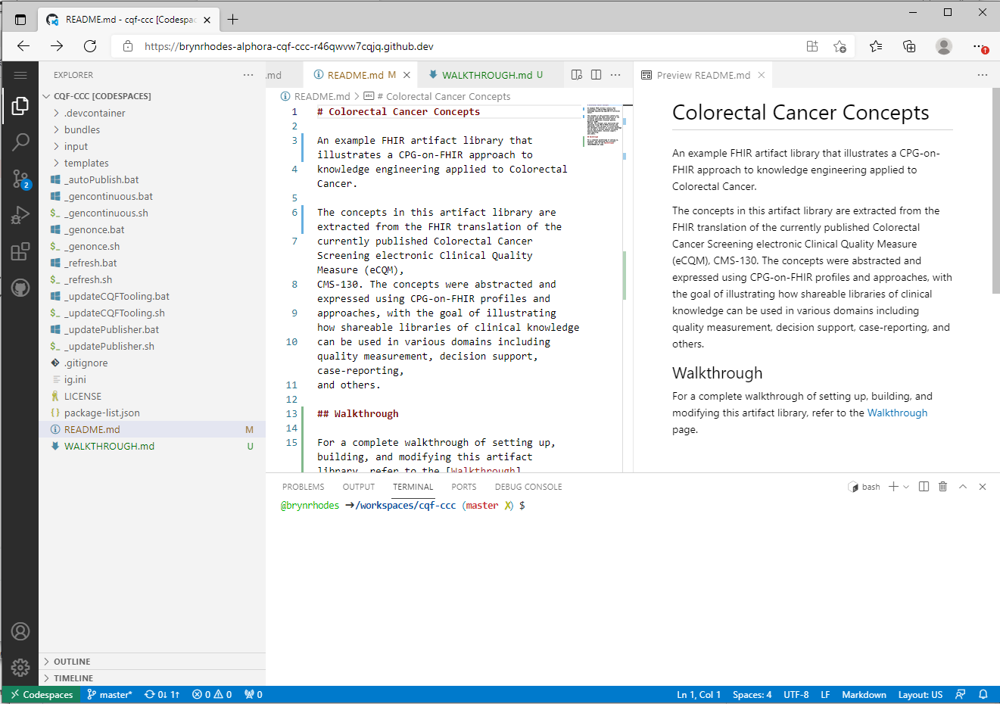

# Colorectal Cancer Concepts Walkthrough

This walkthrough guides you through setting up, building, and modifying the Colorectal Cancer Concepts artifact library to illustrate how to author, distribute, and consume FHIR- and CQL-based knowledge artifacts for decision support and quality measurement related to Colorectal Cancer Screening.

## Overview

The walkthrough is organized into the following sections:

* [Background](#background)
* [USPSTF Recommendation on Colorectal Cancer Screening](#uspstf-recommendation-on-colorectal-cancer-screening)
* [Setting Up](#setting-up)
* [Artifact Source](#artifact-source)
* [Building the Artifact Library](#building-the-artifact-library)
* [Unit Testing](#unit-testing)
* [Running the Decision Support](#running-the-decision-support)
* [Running the Quality Measure](#running-the-quality-measure)
* [Updating the Content](#updating-the-content)

## Background

This walkthrough is an illustration of FHIR- and CQL-based knowledge artifacts that provide quality measurement and decision support implementations of the US Preventive Services Task Force Recommendation on Colorectal Cancer Screening.

The artifacts are built using the [approach](https://hl7.org/fhir/uv/cpg/approach.html) and [methodology](https://hl7.org/fhir/uv/cpg/methodology.html) of the FHIR Clinical Guidelines IG. The walkthrough does not assume familiarity with this material, but interested readers can find more detailed information.

Specifically, because the knowledge artifacts in this Artifact Library are FHIR canonical resources, the content here is built as a FHIR Implementation Guide, allowing knowledge authors to leverage the FHIR publishing toolchain to provide distribution and documentation of the artifacts.

## USPSTF Recommendation on Colorectal Cancer Screening

The artifacts in this walkthrough provide a platform-independent, standards-based representation of a decision support rule and quality measure for implementing the US Preventive Services Task Force recommendation on Colorectal Cancer Screening:

* The U.S. Preventive Services Task Force (2016) recommends screening for colorectal cancer starting at age 50 years and continuing until age 75 years. This is a Grade A recommendation ([U.S. Preventive Services Task Force, 2016](https://www.uspreventiveservicestaskforce.org/uspstf/recommendation/colorectal-cancer-screening-june-2016)).

> NOTE: This recommendation was updated in May of 2021; the updates have not been applied to this artifact. It is an exercise for the reader to update the content per the 2021 recommendation.

## Setting Up

This walkthrough is focused on using [codespaces](https://github.com/features/codespaces) to allow participants a completely browser-based experience. For a similar walkthrough using desktop tooling, refer to the [Sample Content IG Walkthrough](https://github.com/cqframework/content-ig-walkthrough).

### Provide a Github Account

Codespaces is a feature of Github, so the first step is to sign up for a [Github Account](https://github.com/signup). If you already have a github account, provide your Github ID to the workshop facilitator by emailing it to <info@alphora.com>.

To use codespaces, the workshop facilitator will need to add you to the Alphora github organization. Codespaces is a paid service, and Alphora is sponsoring codespace usage for the purpose of this workshop. Codespace accounts will be available one week prior to and one week after the workshop to allow participants to work through the material.

### Open the Codespace

Once your github account is associated with the Alphora organization, you will be able to open the Colorectal Cancer Concepts repository in a codespace. To do this, navigate to the [Colorectal Cancer Concepts repository](https://github.com/alphora/cqf-ccc), click on the green `Code` dropdown, and click on the `New codespace` button:

This will open the codespace in your browser. While the codespace is initializing, a message will be displayed. Once the codespace setup is complete, you will be presented with a codespace view of the environment:

This environment has everything you need to author, validate, build, test, and package FHIR- and CQL-based knowledge artifacts.

If you have already created a codespace, it will be listed in the Codespaces tab of the Code dropdown.

## Artifact Source

## Unit Testing

## Building the Artifact Library

To build the Artifact Library, run the CQF Refresh tooling, and then the Publisher. Both of these are Java available as Java packages. They're too big to commit to the repository, so there are scripts to make downloading them to your local environment easy. First, make sure the CQF Tooling and Publisher are in your local cache by running the following:

    bash _updatePublisher.sh

    bash _updateCQFTooling.sh

Follow the prompts to allow the downloads to be placed in your local input-cache directory.

Then, run the CQF Tooling refresh with:

    bash _refresh.sh

And finally, run the Publisher with:

    bash _genonce.sh

The result of the publisher step will create the Artifact Library as a FHIR Implementation Guide in the `output` folder, so open a browser on the [index.html](output/index.html) page to see the result.

> NOTE: The index.html link above will open the index.html page in an editor in the environment. Right-click in that editor and select "Open with Live Server" to view the page in your browser.

## Running the Decision Support

## Running the Quality Measure

## Updating the Content

